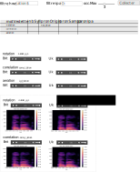

# CNAM athon Pronunciation
Michael Nauge, Université de Poitiers (2022)

*Formation aux **basic skills** du métier d'ingénieur DATA en Science Humaine au travers d'un hackathon de données linguistiques*

## Buts du cours

* Maitriser le web scrappping (requests et beautifulsoup)
* Créer, Croiser, régulariser, enrichir et filtrer des matrices de données (pandas)
* Découvrir la création de widgets interactifs (ipywidgets)
* Déployer une micro application web pour une utilisation côté client (git+myBinder)

## Problématique 

### Discussion autours de la macine à café

> Il me faut une moulinette pour croiser les données d'un dictionnaire de prononciation en langue anglaise de 1757 avec les enregistrements audios contemporains de Linguee ou Longman Dictionary ou Cambridge dictionary. Faudra aussi m'ajouter la transcription de la prononciation en Sampa et IPA pour que ça serve réellement à quelque chose.*A. Lovelace (chercheuse en SHS)* 

Si je comprends bien il faut :
* Utiliser un dictionnaire ancien
* Collecter des données variées dispersées dans des plateformes web
* Les re-structurer, les enrichir et les régulariser pour les croiser avec un vieux dictionnaire
* Créer différentes matrices dynamiquements facilitant l'interrogation

C'est ça ?

> Oui, je veux bien des graphiques interactifs aussi avec des widget sympas. Et que je puisse m'en servir depuis ma tablette quand je suis à la maison.

Euh, oui, on verra ce qu'on peut faire dans les temps. C'est pour quand ?

> Hier, évidemment. Mais j'ai eu exeptionnelement une extension de deadline de 7 jours pour soumettre mon article à une prestigieuse conférence internationale ;-)

Ah, parfait, on est large alors :-)

### Cahier des charges
*Info législatives relatives à la collecte de données (16/12/2021) : [ouvrir la science](https://www.ouvrirlascience.fr/la-fouille-de-textes-et-de-donnees-a-des-fins-de-recherche-une-pratique-confirmee-et-desormais-operationnelle-en-droit-francais/?utm_campaign=Data%20veille&utm_medium=email&utm_source=Revue%20newsletter)*

1. Dans le fichier prenom_nom_scrapping.ipynb : Réaliser un scrapper de fichier audio depuis l'une des sources suivantes (https://www.ldoceonline.com/dictionary/love, https://www.linguee.fr/anglais-francais/traduction/love.html, https://dictionary.cambridge.org/dictionary/english/love) (jeter un oeil sur scrapAndParse.ipynb)
    1. Obtenir l'url du mp3 en anglais britannique et anglais américain d'un mot vedette cible
    1. Obtenir l'information complémentaire POS (part of speech) ou IPA (international phonetic alphabet) (bonus)
    1. Obtenir toutes les urls de mp3 si il y a plusieurs variantes car le mot existe avec plusieurs POS (bonus)
    

1. Dans le fichier prenom_nom_manipDataframe : Produire par programmation un enrichissement du dictionnaire de Buchanan 1757 en ajoutant (jeter un oeil sur pandasTricks.ipynb): 
    1. une colonne motVedette (transformation/simplification de la prononciation d'origine) en utilisant le mapping du fichier Buchanan_PronChar_counts.csv 
    1. une colonne Sampa et une colonne Ipa à partir des mots vedettes obtenus (transformation/croisement de données) en utilisant ./../data/dataframe/BigiRichSample.csv
        1. isoler les mots de Buchanan qui n'existent pas dans Bigi. Tenter de comprendre les différentes causes et tenter d'expliquer comment résoudre les différents problèmes (bonus) 
    1. sauvegarder la nouvelle matrice obtenue dans ./../data/dataframe/BuchananRich.csv

1. Dans le fichier prenom_nom_App.ipynb : Construire une UI permettant de filtrer les entrées du dictionnaire enrichi de Buchanan (s'inspirer de ça https://gitlab.huma-num.fr/mshs-poitiers/forellis/dicodiachro/-/blob/master/codes/interact/interact_Walker.ipynb) sur :
    1. la colonne motVedette (expression régulière) 
    1. la colonne prononciation ipa (expression régulière)(bonus)
    1. une taille maximale d'échantillon résultat
    1. un bouton demandant la collecte/scrapping des fichiers audios (depuis des sources externes) des entrées isolées 

    1. Afficher en résultat (jeter un oeil sur librosa.ipynb)
        1. un player pour chaque audio collecté
        1. le spectrogramme pour chaque audio collecté (bonus)
        
1. Déposer/deployer grace à un entrepot GIT+myBinder 

### Maquette de l'UI
 

## Projet à réaliser 

Avoir déployé une micro application web permettant le croisement entre les données d'un dictionnaire ancien et les prononciations contemporaines tels que décrit dans le cahier des charges. 

Les objectifs dans le cahier des charges qui portent l'annotation **(Bonus)** sont à considérer comme devant être réalisés dans une seconde itération de développement. Il faut avoir déployé une V1 fonctionnel avant de passer aux bonus. Les bonus servent à passer d'une note de 13 à 20.

Les projets réalisés doivent être déposées sous forme de dépôt GitHub. Le lien vers le dépôt Git à évaluer doit m'être transmis par mail pour le 30/01/2022.

Le dépôt Git de ce cours doit servir de modèle de structuration de données et codes. Le readme.md devra contenir un lien pour le lancement de l'application via myBinder (en mode notebook et en mode voilà).

## Mon projet

[Voila](https://mybinder.org/v2/gh/anisshl/dicoCo.git/HEAD?urlpath=%2Fvoila%2Frender%2Fnotebook%2Fanis_sahli_App.ipynb)

Travail réalisé avec le site [Cambridge]https://dictionary.cambridge.org/fr/

L'appliscation est composée de 3 parties.

La première partie consiste à récupérer un fichier CSV qui a été conçu à l'aide du notebook anis_sahli_manipDataframe. Dans une partie observation et investigation au sein de notre the notebook je tente d'apporter des éléments de réponses à la question à la question "isoler les mots double qui n'existent pas dans Bigi, comprendre les différentes causes et tenter d'expliquer comment résoudre les différents problèmes".

En effet il semblerait que certains caractères soient en réalité composés de 2 caractères dans le mot d'origine or dans notre dictionnaire de matching des caractères chacun d'entre eux est de taille 1. Cela semble être notamment le cas pour des mots contenant le caractère suivant " ' ".
Un peu plus de 5000 mots finissent donc par ne matcher avec aucun mot de la table Bigi.

Une proposition a donc été faite, celle de se servir d'une librairie de text machine comme par exemple "fuzzywuzzy". Avec un rapide exemple, on montre que même sans aucune data préparation, nous sommes capable d'identifier des similitudes.

La deuxième partie se compose d'une fonction de scrapping qui permet de scrapper à la demande de l'utilisateur.
Cette fonction permettra à ce dernier de saisir une entrée (regex possible) et de retourner en sortie le résultat de la recherche. Si en dehors du mot recherché, rien ne s'affiche, alors cela revient à dire qu'aucun résultat n'est trouvé sur le site. La fonction de scrapping utilisée dans l'application finale a légèrement été modifiée par rapport à sa première version dans le fichier anis_sahli_scrapping.

Dans cette partie j'ai également tenté d'enregisrter des fichiers audios pour pouvoir utiliser la librairie librosa. Malheureusement avec le site Cambridge à partir du lien du fichier MP3, une erreur est retournée lorsque l'on souhaite y accéder.

J'ai donc essayer de contourner c problème avec la librairie selenium pour simuler en quelques sortes le comportement humain, mais malheureusement le paramètre "download.default_directory" ne fonctionne pas pour ma part. Il m'est donc impossible de choisir le dossier de téléchargement souhaité pour mon fichier MP3 et celui-ci se fait donc dans un dépôt par défaut. Vous trouverez un extrait de ce code dans le notebook tentative_selenim_App dans la rubrique test selenium.

La troisième partie consiste tout simplement en l'affichage de l'interface avec les différentes possibilités de saisies par l'utilisateur et le retour de l'ensemble des résultats demandés.

